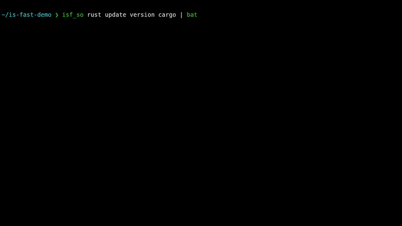

# **Demos: Exploring the Capabilities of `is-fast`**

`is-fast` is designed for speed and efficiency in browsing, searching, and extracting web content. Below are demonstrations showcasing its key features.

---

## 🚀 **Fast & Efficient Browsing**
Effortlessly see search results, scroll through pages, and quickly jump between results. Users can see the top results for their searches and navigate between them. The next page is always preloaded, so you shouldn't have to wait.


---

## 🔍 **Search Your History with Fuzzy Matching**
Easily find and reopen pages you've visited before using powerful fuzzy search. Your history is stored in a local database so it's always available.


---

## 🔗 **Direct Navigation & Content Extraction**
Already know the page you're looking for? Jump straight to it. Using selectors, you can filter and extract only the relevant parts of a webpage. Piping the output allows integration with other tools.


---

## 📂 **Working with Local Files**
No internet? No problem! Load and format saved HTML files with ease. Use predefined selectors based on the original URL, or specify custom ones for targeted extraction. Output formatted content to standard out for further processing.


---
# Scripting Applications

These are a number of small scripts that I wrote to demonstrate the power of `is-fast` as a CLI and scripting tool. You can find these scripts in the [scripts](../scripts) folder.

## What

This script returns the first paragraph of the wikipedia article about what you searched, giving you a nice overview of that person/thing.

```sh
isf_what() {
    is-fast \
        --direct "en.wikipedia.org/wiki/${*}" \
        --selector "div.mw-content-ltr > p" \
        --color=always \
        --piped \
        --nth-element 1 \
        --pretty-print="margin:20"
}
```


## Stocks

Check current stock prices!

```shell
isf_stock() {
    is-fast \
        --direct "https://finance.yahoo.com/quote/${1}/" \
        --selector "section.container > h1, span.base" \
        --piped \
        --no-cache \
        --pretty-print="margin:5"
}
```


## Define

This script finds the definition of the given word.

```sh
# NOTE capitalization is specific for ZSH - for BASH change to ${1^}
isf_define() {
    is-fast \
        --direct "www.merriam-webster.com/dictionary/${1}" \
        --selector "div.sb" \
        --nth-element 1 \
        --color=always \
        --pretty-print="margin:20,title:${(C)1}" \
        --piped
}

```


## Search Stack Overflow

This script searches Stack Overflow for a related question, and displays a well formatted question and answer directly to the terminal.

```sh
isf_so() {
    QUESTION=$(is-fast ${*} --site "www.stackoverflow.com" --selector "div.question .js-post-body" --color=always --pretty-print="margin:20,title:Question" --piped --flash-cache) # Find the question content.
    ANSWER=$(is-fast --last --selector "div.accepted-answer .js-post-body" --color=always --pretty-print="margin:20,title:Answer" --piped --flash-cache) # Separately find the answer content.
    cat << EOF 

$QUESTION
$ANSWER

EOF
}

```


